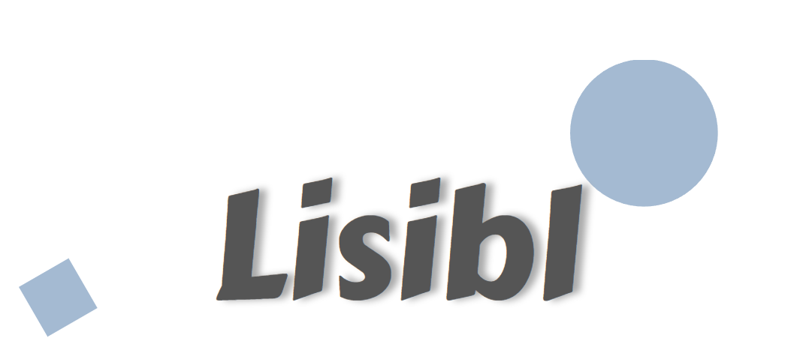

# Lisibl

<!--  -->

## Try it now

Go to [lisibl.bruxelles.dev](https://lisibl.bruxelles.dev/) to start reading.

## Screenshots

<!--  -->

## Contributing

Contributions are always welcome! For major changes, please [open an issue](https://github.com/jdbruxelles/lisibl/issues/new) first to discuss what you would like to change.

## Licence

[MIT License](LICENSE)
